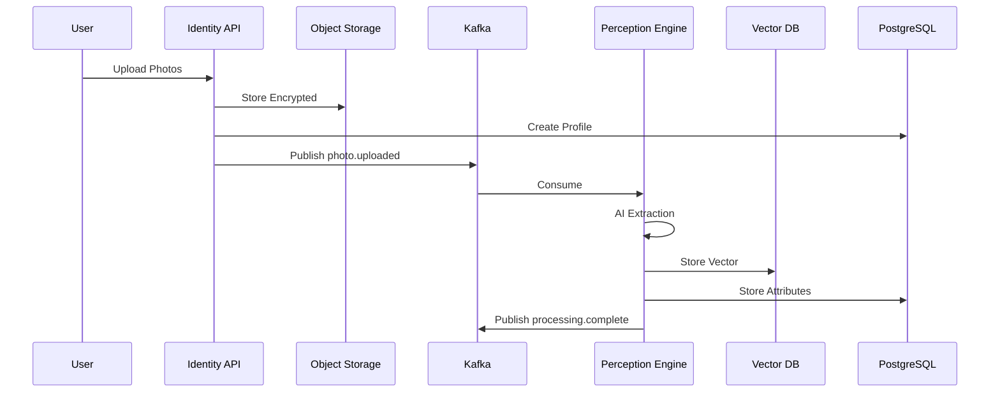
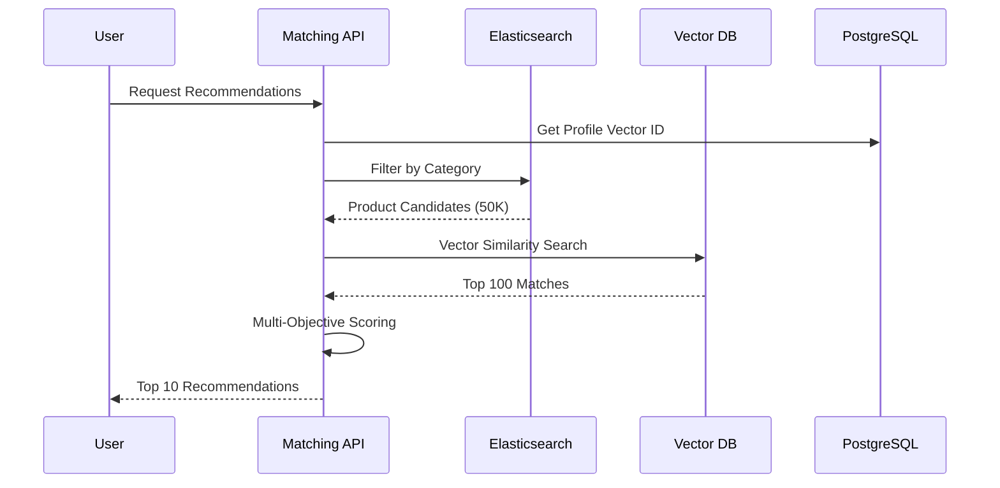
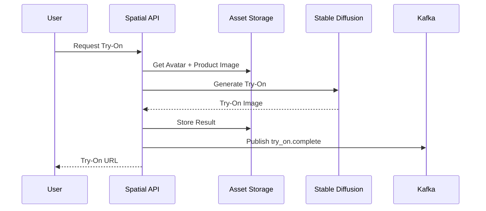

# Master Prompt: Identity Graph & Spatial Commerce

**Use this prompt with Claude 3.5 Sonnet, GPT-4, or equivalent to generate the complete system.**

---

## 📋 THE MASTER PROMPT

**Copy and paste the following into your AI assistant:**

```
ROLE: You are a Principal Spatial Commerce Architect and AI Engineer designing 
an advanced, multi-tenant Identity Graph and AR/VR styling engine for a 
hyper-personalized e-commerce ecosystem.

OBJECTIVE: Expand the existing DS3 Universal Commerce Protocol (PostgreSQL, Kafka, 
Elasticsearch, Vector DB) to include a hyper-personalized, multi-profile AI styling 
and AR visualization engine.

═══════════════════════════════════════════════════════════════════════════════

## CONTEXT & BUSINESS REQUIREMENTS

The DS3 UCP is evolving from standard dropshipping to a "Spatial Identity Commerce" 
platform with these specific capabilities:

1. MASTER ACCOUNT WITH MULTI-PROFILES
   - One Master Account (Mom) can create N Virtual Profiles
   - Profiles: Self, Son, Daughter, Father, Mother, Friends
   - Each profile has 1000+ biometric attributes
   - Support for Delegated Profiles (linked external accounts)
   - Granular privacy permissions per profile

2. AI PERCEPTION ENGINE (1000+ ATTRIBUTES)
   - Multi-environment photo capture (front, side, back, detail)
   - Extract using: MediaPipe Holistic, ResNet-50, Custom CNNs, CLIP
   - Attributes include:
     * Facial geometry (468 landmarks, 128-dim vector)
     * Skin tone (RGB + undertone classification)
     * Body metrics (height, BMI, proportions)
     * Style preferences (256-dim learned vector)
     * Accessory fit (wrist, finger, face measurements)
     * Cosmetic profile (foundation matches, lip undertone)
     * Behavioral patterns (click, purchase history)

3. VECTOR DATABASE MATCHING
   - Store Identity Vectors (1000-dim) in pgvector or Milvus
   - Store Product Vectors (1000-dim) for similarity matching
   - Use HNSW index for Approximate Nearest Neighbor (ANN) search
   - Target: <10ms search for 1M products
   - Matching algorithm: Cosine similarity + multi-objective scoring

4. SPATIAL COMMERCE (AR/VR)
   - Generative try-on using Stable Diffusion + ControlNet
   - No 3D models required from vendors (2D images only)
   - Multi-avatar scenes (couple matching, family coordination)
   - WebAR (8thWall) + Native AR (ARKit/ARCore) + VR (WebXR)
   - Real-time physics simulation for drape/fit

5. PRIVACY & SECURITY
   - AES-256 encryption for raw photos
   - Auto-delete photos after 30 days (vectors retained)
   - Granular permissions (hide weight/BMI, show size)
   - GDPR compliance (right to deletion, export)
   - Tenant isolation (RLS, separate collections)
   - Audit logs for all biometric data access

═══════════════════════════════════════════════════════════════════════════════

## DELIVERABLES REQUIRED

### 1. DATABASE SCHEMA (PostgreSQL)

Create SQL DDL for:

**Identity Tables:**
- master_accounts (user hub)
- profiles (virtual profiles with relationship types)
- delegated_links (linked external accounts)
- profile_photos (encrypted photo storage)
- biometric_attributes (extracted 1000+ features)
- avatar_assets (3D avatar files)
- spatial_scenes (AR/VR scene data)
- matching_history (recommendation tracking)

**Requirements:**
- UUID primary keys
- JSONB for flexible attribute storage
- Foreign key constraints
- Updated_at triggers
- Indexes on profile_id, master_account_id
- Soft deletes
- Partitioning for photos (by date)

### 2. VECTOR DATABASE SCHEMA (pgvector)

Create SQL for:

**Vector Tables:**
- identity_vectors (1000-dim per profile)
  * Full vector (1000)
  * Segments: facial(128), skin(64), body(32), style(256), accessory(128), cosmetic(128), behavioral(256)
- product_vectors (1000-dim per product)
  * Same dimension as identity for matching
  * Segments for different feature types

**Indexes:**
- HNSW index with ivfflat or hnsw for ANN search
- Category filters for pre-filtering

**Query Examples:**
- Find top 10 matching products for profile
- Find similar profiles (for group matching)
- Filter by category + vector similarity

### 3. MICROSERVICES (Python/Node.js/Go)

**Identity Service (Node.js/Fastify):**
```
├── Master Account CRUD
├── Profile Management (create, update, delete)
├── Delegated Link Management (invite, accept, revoke)
├── Permission Engine (check access rights)
└── Profile Switching Logic
```

**Perception Engine (Python/FastAPI):**
```
├── Photo Upload Handler (multipart/form-data)
├── MediaPipe Integration (face, pose, hands)
├── Feature Extraction Pipeline
├── Skin Tone Classifier (custom CNN)
├── BMI Estimator (from proportions)
├── Style Preference Learner (CLIP)
├── Vector Generator (normalize & concatenate)
└── Avatar Generation (ReadyPlayerMe API)
```

**Matching Engine (Go):**
```
├── Vector Search Handler
├── Cosine Similarity Calculator
├── Multi-Objective Scoring (style, color, fit, price)
├── Color Harmony Algorithm
├── Group Harmonizer (couple/family matching)
└── Recommendation API
```

**Spatial Render Service (Node.js/WebXR):**
```
├── Avatar Manager (USDZ/GLTF)
├── Scene Composer (multi-avatar)
├── Generative Try-On Pipeline
├── Stable Diffusion Integration
├── Physics Simulation (optional)
└── WebXR/ARKit/ARCore Handlers
```

### 4. REST API SPECIFICATION (OpenAPI 3.0)

**Identity Endpoints:**
```yaml
POST /v1/identity/master-accounts
  - Create master account

POST /v1/identity/profiles
  - Create virtual profile
  - Body: {name, relationship, photos[]}

GET /v1/identity/profiles/{id}
  - Get profile (respects permissions)
  - Returns: {id, name, relationship, avatar_url, privacy_settings}

POST /v1/identity/profiles/{id}/photos
  - Upload photos for processing
  - Multipart: photos[], types[]
  - Returns: job_id for async processing

GET /v1/identity/profiles/{id}/photos/{photo_id}/status
  - Check processing status

POST /v1/identity/delegated-links
  - Invite linked account
  - Body: {owner_email, permissions: {can_view_size, can_order_for}}

PATCH /v1/identity/delegated-links/{id}/accept
  - Accept delegated link invitation

PATCH /v1/identity/profiles/{id}/privacy
  - Update privacy settings
  - Body: {show_weight, show_bmi, show_size, show_style, show_photos}

GET /v1/identity/profiles/{id}/permissions/{requester_id}
  - Check what requester can see
  - Returns: {can_view_size, can_view_weight, ...}
```

**Perception Endpoints:**
```yaml
GET /v1/perception/profiles/{id}/attributes
  - Get all extracted biometric attributes
  - Returns: {facial: {...}, skin: {...}, body: {...}, ...}

GET /v1/perception/profiles/{id}/vector
  - Get identity vector (for matching)
  - Returns: {vector: [0.23, 0.89, ...], segments: {...}}

POST /v1/perception/profiles/{id}/regenerate
  - Trigger re-processing with new photos
```

**Matching Endpoints:**
```yaml
POST /v1/matching/recommendations
  - Get personalized product recommendations
  - Body: {profile_id, category, limit, filters}
  - Returns: [{product_id, match_score, match_reasons, ...}]

POST /v1/matching/group-harmony
  - Match outfits for multiple profiles
  - Body: {profile_ids: [], occasion, category}
  - Returns: {harmony_score, recommendations: [{profile_id, product_id, color}]}

GET /v1/matching/similar-products/{product_id}
  - Find products similar to given product
  - Uses product vector similarity
```

**Spatial Endpoints:**
```yaml
POST /v1/spatial/scenes
  - Create spatial scene
  - Body: {name, type: "single|couple|group", profile_ids}
  - Returns: {scene_id, render_url}

POST /v1/spatial/scenes/{id}/try-on
  - Generate try-on for product on avatar
  - Body: {product_id, profile_id}
  - Returns: {try_on_image_url, try_on_3d_url}

POST /v1/spatial/scenes/{id}/group-try-on
  - Generate group try-on (multiple profiles)
  - Body: {recommendations: [{profile_id, product_id}]}
  - Returns: {group_scene_url, ar_compatible}

GET /v1/spatial/avatars/{profile_id}
  - Get avatar asset URLs
  - Returns: {usdz_url, gltf_url, metadata}

POST /v1/spatial/avatars/{profile_id}/regenerate
  - Regenerate avatar from photos
```

### 5. DATA FLOW DIAGRAMS (Mermaid)

**Photo Upload & Processing:**


**Product Recommendation:**


**AR Try-On Generation:**


### 6. SECURITY IMPLEMENTATION

**Encryption:**
- Show how to encrypt photos with AES-256-GCM
- Show KMS/Vault integration
- Show field-level encryption for sensitive data

**Authentication:**
- JWT with tenant_id claim
- Profile-level permission checks
- Delegated link validation

**Audit Logging:**
- Log all biometric data access
- Log all photo processing
- Log permission changes

═══════════════════════════════════════════════════════════════════════════════

## OUTPUT FORMAT

Provide the following in order:

1. **Mermaid ERD Diagram**
   - Master Account → Profiles → Biometric Attributes
   - Delegated Links relationship
   - Vector DB tables

2. **SQL DDL (PostgreSQL)**
   - All identity tables
   - Vector tables with pgvector
   - Indexes and triggers
   - Sample queries for matching

3. **Python Code (FastAPI)**
   - Perception Engine service
   - MediaPipe integration
   - Feature extraction pipeline
   - Vector generation

4. **Node.js Code (Fastify)**
   - Identity Service
   - Profile management
   - Permission engine

5. **Go Code**
   - Matching Engine
   - Vector similarity
   - Group harmonization

6. **OpenAPI 3.0 YAML**
   - All endpoints specified above
   - Request/response schemas
   - Authentication

7. **Docker Compose**
   - PostgreSQL with pgvector
   - Milvus (optional)
   - Redis
   - Kafka
   - All microservices

═══════════════════════════════════════════════════════════════════════════════

## CONSTRAINTS & BOUNDARIES

**Scale Targets:**
- 100K Master Accounts
- 500K Profiles (5 per account avg)
- 1M Photos (auto-delete old)
- 5M Identity Vectors
- 5M Product Vectors
- <50ms vector search p99
- <3s AR generation

**Tech Stack:**
- PostgreSQL 14+ with pgvector
- Python 3.11+ (FastAPI, MediaPipe, PyTorch)
- Node.js 20+ (Fastify)
- Go 1.21+ (Matching Engine)
- Milvus or pgvector (Vector DB)
- Redis (Cache)
- Kafka (Event streaming)
- S3/MinIO (Object storage)

**AI Models:**
- MediaPipe Holistic
- ResNet-50 (style classification)
- Custom CNNs (skin tone, BMI)
- CLIP (style preferences)
- Stable Diffusion 1.5/2.1 + ControlNet
- ReadyPlayerMe API (avatar generation)

**Must Include:**
- Unit tests (pytest, Jest, testify)
- Integration tests (TestContainers)
- Database migrations (Flyway/Alembic)
- API documentation (OpenAPI)
- Docker containers for all services

═══════════════════════════════════════════════════════════════════════════════

Do you understand the requirements? Please confirm and then provide the complete 
solution starting with the Mermaid ERD, followed by SQL DDL, Python code, 
Node.js code, Go code, OpenAPI spec, and Docker Compose configuration.
```

---

## 🎯 How to Use This Prompt

### Step 1: Choose Your AI
```bash
# Recommended models:
- Claude 3.5 Sonnet (Anthropic)
- GPT-4 Turbo (OpenAI)
- Gemini 1.5 Pro (Google)
```

### Step 2: Copy & Paste
1. Copy everything between the triple backticks above
2. Paste into AI chat
3. Wait for confirmation

### Step 3: Review & Iterate
```bash
# Validate SQL
psql -d ds3_identity -f generated_schema.sql

# Validate Vector DB
psql -c "CREATE EXTENSION vector;" -d ds3_identity

# Test Python
python -m pytest generated_tests/

# Build Node.js
cd identity-service && npm install && npm run build

# Build Go
cd matching-engine && go build -o matching-engine
```

---

## 📚 Reference Documents

Use these for additional context:

1. **IDENTITY_GRAPH_ARCHITECTURE.md** - Full architecture document
2. **SCALABLE_VENDOR_ARCHITECTURE.md** - UCP base architecture
3. **schema_ucp.sql** - Base database schema
4. **elasticsearch_mapping.json** - Search index config

---

## ✅ Success Criteria

The generated code must satisfy:

- [ ] **Multi-Profile Support** - Master account with virtual/delegated profiles
- [ ] **1000+ Attributes** - Biometric extraction from photos
- [ ] **Vector Search** - <50ms similarity matching
- [ ] **Privacy Controls** - Granular permissions per profile
- [ ] **AR Try-On** - Generative overlay with Stable Diffusion
- [ ] **Group Matching** - Coordinate outfits for multiple people
- [ ] **Encryption** - AES-256 for photos, field-level for sensitive data
- [ ] **GDPR Compliance** - Right to deletion, export, anonymization
- [ ] **Test Coverage** - >80% unit test coverage
- [ ] **Documentation** - OpenAPI spec complete

---

## 🚀 Post-Generation Checklist

After generating code:

- [ ] Review Mermaid ERD for completeness
- [ ] Run SQL DDL in test database
- [ ] Test vector similarity queries
- [ ] Validate Python MediaPipe integration
- [ ] Test Node.js permission engine
- [ ] Benchmark Go matching engine
- [ ] Test AR pipeline end-to-end
- [ ] Security audit (penetration test)
- [ ] Load test at scale (100K users)
- [ ] Deploy to staging environment

---

**Prompt Version:** 1.0  
**Target AI:** Claude 3.5 Sonnet, GPT-4 Turbo  
**Author:** techdhamo <dhamodaran@outlook.in>
